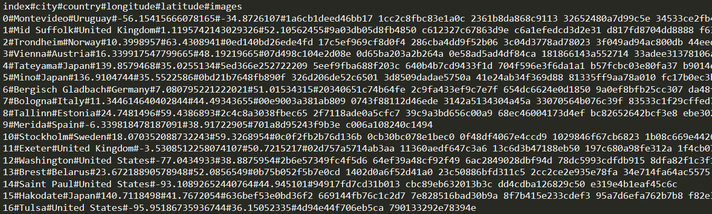
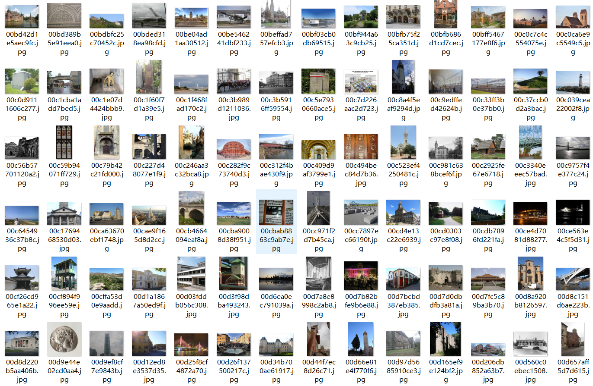

# Introduction

## Dataset

Dataset is provided at https://www.kaggle.com/datasets/o0o0oo/geoglobe

Here is a screenshot of parts of the data from the full dataset:

  
  

## Run

### Train

First, rewrite the CSV file 'agent/agent_settings.csv'; each line presents an agent name with prompts you want to use.

Second, please revise 'config.py' if needed.

Then, run '' python LLM_train_main.py '' to initiate the environment and start the main training process.

Next, for each agent, run '' python LLM_single_agent_main.py --agent_num {i} --cuda {X}'' to start the agent process.

PS: Thanks to the projects https://github.com/songquanpeng/one-api that allows us to use the same API calling different closed-source LLMs. You may deploy a one-api server before run this code (revise the url in 'agent/chatgpt').

### Inference

Run '' python LLM_inference_main.py '' for testing (Make sure 'save-path/model.pth' is provided).

## File structure

+ agent
    - agent_settings.csv
    - agents.py
    - llava.py
    - qwen.py
    - zephyr.py
    - chatgpt.py
    - claude.py
    - cogvlm.py
    - cogagent.py has bug, need to repair
+ discussion
    - stage1.py
    - stage2.py
    - stage3.py
+ data
    - pic
    - preprocess
    - location.csv
+ tmp
    - discussion
        * stage_1.csv
        * stage_2.csv
        * stage_3.csv
        * stage_1_lock*
        * stage_2_lock*
        * stage_3_lock*
    - figure
        - X#X#....jpg
        - img_lock*
    - review_agents.csv
    - readme.md
+ saved
    - agent_*.log
    - train_main.log
    - model.pth
+ search_engine
    - img_web_search.py
    - ...
+ utils
    - dataset.py
    - my_utils.py
    - geo_utils.py
    - logger.py
    - train_utils.py
+ jwt & Mygeopy
+ config.py
+ LLM_train_main.py
+ LLM_inference_main.py
+ LLM_single_agent_main.py
+ Readme.md

### agent folder

LLM agent related code, and agent network structure related code.

agents.py is the main entry point for each agent to start, each agent is responsible for three stages, stage1: answer questions; stage2: review the questions answered by others; stage3: summarize other people's opinions and give the final result.

Other *.py defines a unified interface for different LLM calls, temporarily does not define its parent class and the interface must be implemented (submitted to the arsenal platform, you need to load the model from the model library to the corresponding runtime environment, the code at this time you need to add an additional part of the operation, specific reference to the existing documents in the writing method)

agent_settings.csv defines the ID of the agent participating in the discussion, the path (name) of the model and its corresponding prompt settings (default is empty).

### discussion folder

AGENT answer, review, or summarize phase of the process.

### search_demo

Code for searching on images through the web.

### data folder

The full dataset cannot be uploaded in anonymous mode, a small dataset is currently provided.

### saved folder

model.pth is the parameters saved by the model, others are log files.

### tmp folder

Used to simulate multiple models for discussion [do not change].

### utils folder
Some tool classes.

dataset: Used to read data from a loaded dataset;

geo_utils: City geographic information matching, distance calculation between two places, etc;

my_utils: It is mainly used for trivial tasks such as text-related processing;；

train_utils: Used to pass parameters at model startup;

logger: Used to record the runtime log to the screen/file, all the files in this project should call this class to realize the logging.

### config.py

All hyperparameters that need to be defined in the framework.

### LLL_xxxx_main.py

The Main Entrance of the code
